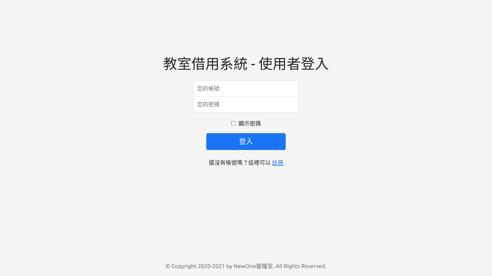
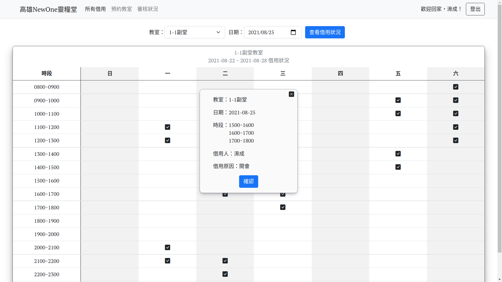
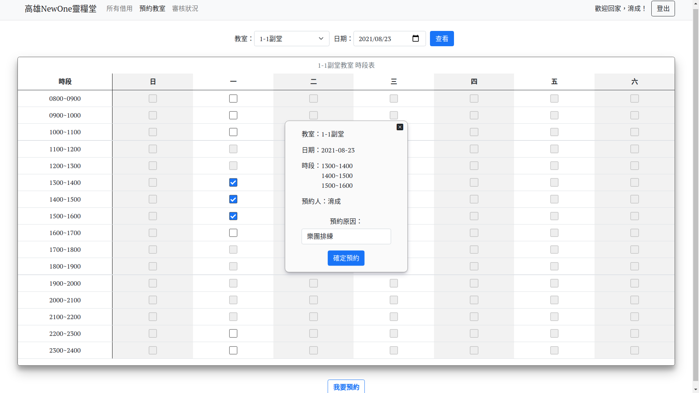
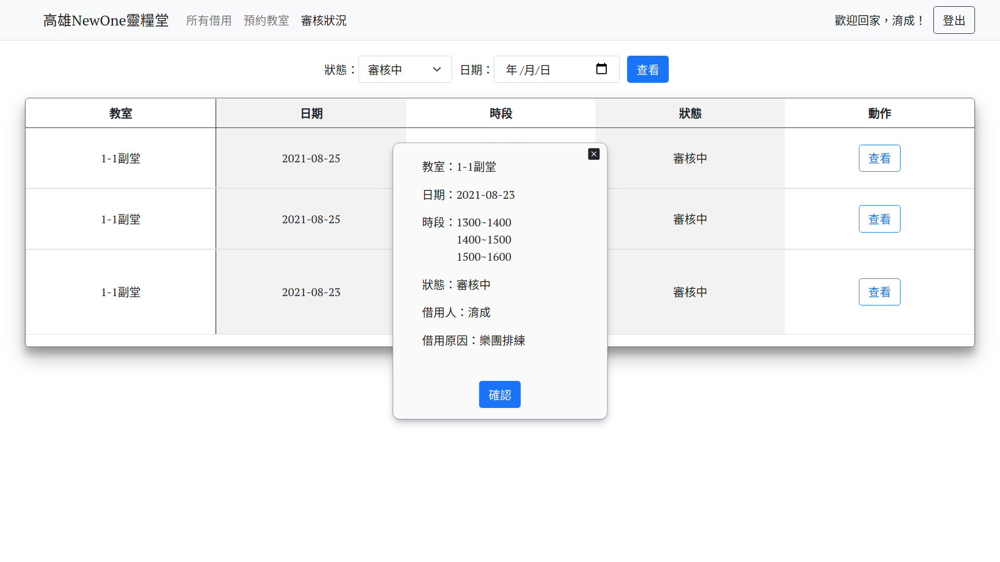
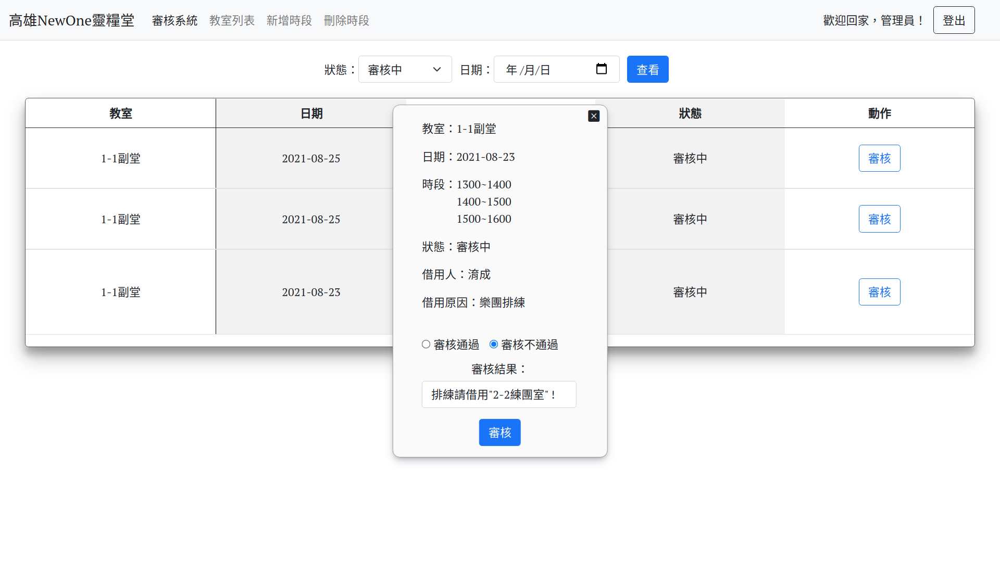
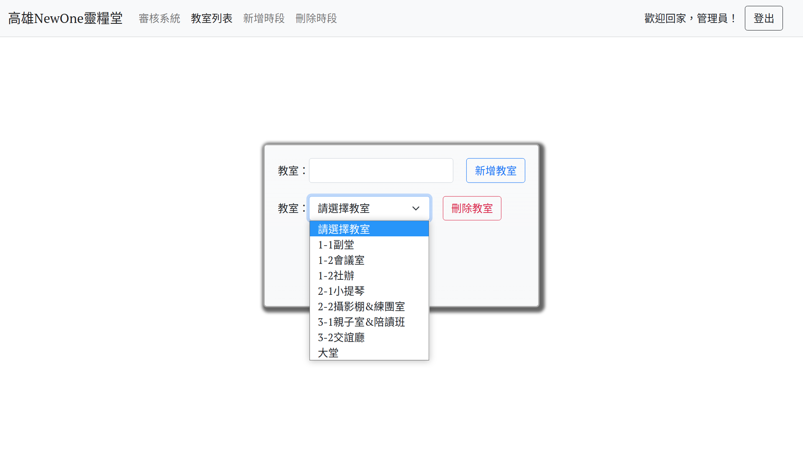
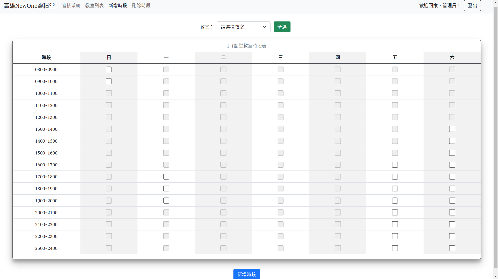

# 教室借用系統

# Demo

- 登入/註冊:

    

- 查看指定教室的借用狀況:

    

- 預約教室:

    

- 查看審核狀況:

    

- 後台審核系統:

    

- 新增/刪除教室:

    

- 開放/關閉可借用時段:

    

## Technologies

- Frontend

  - Language : Vanilla HTML/CSS/JavaScript

  - Plugins：Bootstrap

  - compiler：Webpack

- Backend

  - Architecture：MVC

  - Language：Node.js

  - View Engine：Handlebars

  - Database：MongoDB Atlas(host on cloud)

  - compiler : Babel

  - Auth Library：Passport.js

## Features

1. 基於角色的權限管理系統 (功能：*登入、登出、註冊*。角色：*使用者、管理員*)

2. 查看所有通過審核的教室借用紀錄 (所有人、不須登入)

3. 審核系統 (管理員)

4. 新增/刪除教室 (管理員)

5. 開放/關閉教室可借用時段 (管理員)

6. 預約教室 (使用者)

7. 查看審核狀況 (使用者)

8. 自動審核已過期的教室預約 (系統自動處理)

9. 資料過濾器 (功能：資料欄位的值可以指定或留空)

## Usage

1. setting environment variables in `.env` file:

    ```.env
    PORT=<port>
    NODE_ENV=<development | production>
    MONGODB_URI=<your-mongodb-uri>
    SESSION_SECRET=<your-session-secret>
    ```

2. install all dependenvies version-locked:

    ```bash
    $ npm ci
    ```

3. bundle all js&css files via `webpack`(target: browser):

    ```bash
    $ npm run webpack
    ```

4. compile `es6` to `es5` via `babel`(target: server):

    ```bash
    $ npm run build
    ```

5. install all dependencies version-locked which are only needed in runtime:

    ```bash
    $ npm ci --production
    ```

6. start web server:

    ```bash
    $ npm run start
    ```

7. just check the website in your browser: `http://localhost:<port>`
